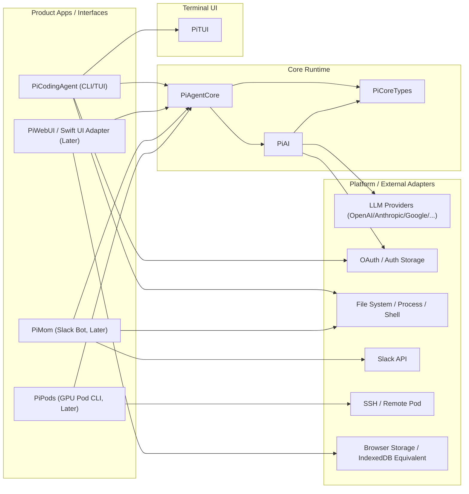

# pi-swift Architecture (Initial)

## 1. Purpose

This document defines the target architecture and module boundaries for `pi-swift`, guiding phased implementation while keeping parity with `../pi-mono` under control.

The point is not to implement every module immediately, but to establish a clear dependency order and regression boundary first.

## 2. Design Goals

- Match `pi-mono` feature semantics (not TypeScript implementation details)
- Keep modules decoupled for package-by-package migration and independent testing
- Make core logic highly testable with SwiftPM unit tests
- Isolate platform-specific concerns (CLI/TUI/Web/Slack/SSH) behind adapter layers

## 3. Module Mapping (pi-mono -> pi-swift)

Suggested Swift module layering (final names can be confirmed in P1):

- `PiCoreTypes`: shared foundational types for messages/events/tools/schema
- `PiAI`: unified LLM API, provider abstractions, stream events, OAuth helpers
- `PiAgentCore`: agent loop, state management, tool execution orchestration
- `PiTUI`: terminal rendering and interaction components
- `PiCodingAgent`: product-level CLI layer (sessions, skills, extensions, settings, modes)
- `PiWebUIBridge` (optional/later): Web UI parity layer (if needed)
- `PiMom` (later): Slack bot
- `PiPods` (later): GPU pod / vLLM management CLI

## 4. High-Level Architecture Diagram (Target)

## 5. Dependency Order (Why This Sequence)

Migration must follow the dependency chain:

1. `PiCoreTypes`
2. `PiAI`
3. `PiAgentCore`
4. `PiTUI`
5. `PiCodingAgent`
6. Peripheral modules such as `PiMom`, `PiPods`, and Web UI layers

Why:

- `coding-agent` depends heavily on `agent`, `ai`, and `tui`
- `agent` directly depends on `ai`
- Peripheral modules are mostly integration layers built on top of the core runtime

## 6. Parity Strategy vs pi-mono

### 6.1 Behavioral Parity First

- Use `../pi-mono` tests and README docs as behavioral samples
- Build Swift comparison tests (golden/fixture-based) for critical behaviors
- Keep event ordering, error messages, and edge-case handling as consistent as practical

### 6.2 Platform-Difference Handling

- Abstract Node.js-specific capabilities (processes, shell, file permissions) behind protocols
- Isolate Browser/IndexedDB/Web Components functionality in later modules
- Use adapters plus mock tests for external integrations such as Slack/SSH

## 7. Testing and Regression Architecture (Required)

Recommended test layers:

- Unit tests: pure logic (parsers, state, event mapping, validation)
- Component tests: TUI component rendering/interaction
- Integration tests: agent loop + tool execution + session flows
- Golden/fixture tests: parity with `pi-mono` event sequences and outputs

Coverage requirements:

- Core logic coverage should be as close to 100% as practical
- Every regression fix must add a regression test

## 8. Documentation and Task Linkage

- Feature definitions live in `docs/PRD.md`
- Execution plan and status tracking live in `docs/PLAN.md`
- This document describes architecture and boundaries only; it does not track task status

## 9. To Be Refined Later (During P1/P2)

- Actual Swift module names and directory layout
- Concurrency model constraints (Swift Concurrency)
- Provider adapter protocol details
- Session persistence format and migration strategy
- Cross-platform terminal compatibility strategy for the TUI abstraction
