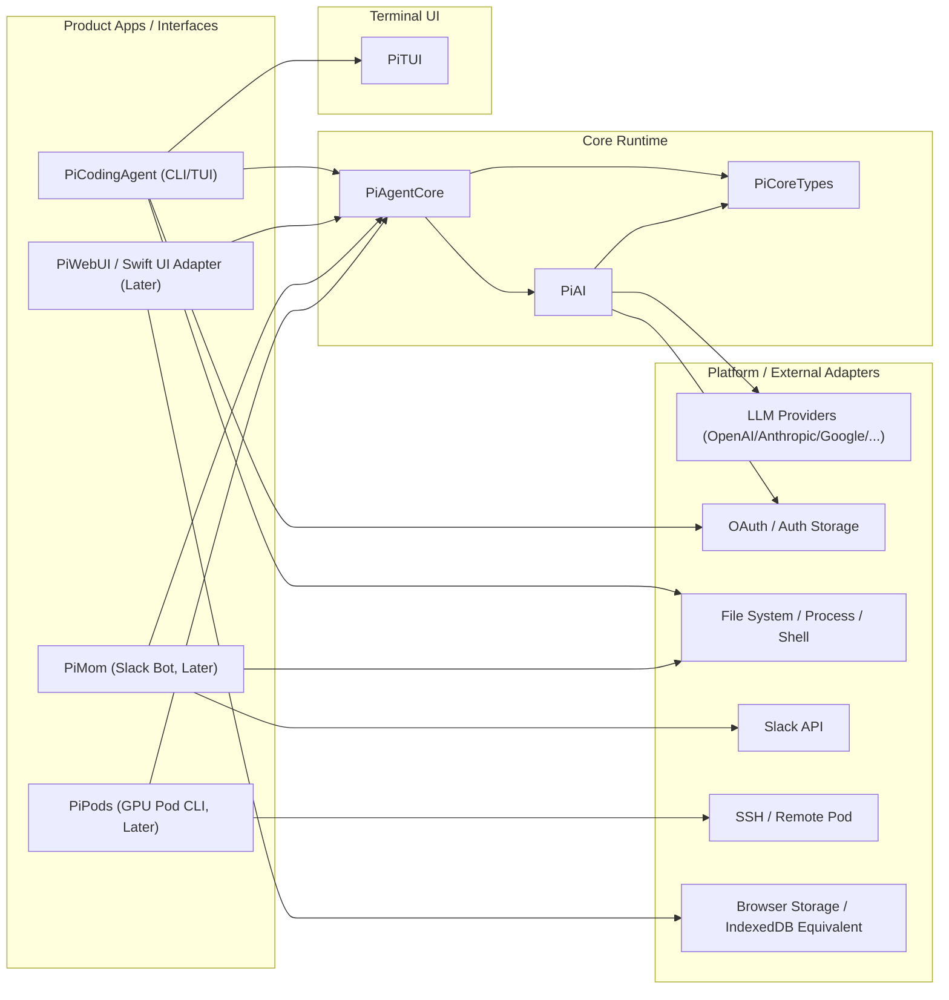

# pi-swift 整体架构（初版）

## 1. 目的

本文件定义 `pi-swift` 的目标架构与模块边界，用于指导按 phase 实施，并保证对 `../pi-mono` 的功能对齐不失控。

重点不是一开始把所有模块实现完，而是先建立清晰依赖顺序与回归边界。

## 2. 设计目标

- 对齐 `pi-mono` 功能语义（而非 TypeScript 实现细节）
- 模块解耦，便于逐包迁移与独立测试
- 核心逻辑可在 SwiftPM 单测中高覆盖验证
- 平台相关能力（CLI/TUI/Web/Slack/SSH）通过适配层隔离

## 3. 模块映射（pi-mono -> pi-swift）

建议的 Swift 模块分层（名称可在 P1 确认）：

- `PiCoreTypes`：共享消息/事件/工具/schema 基础类型
- `PiAI`：统一 LLM API、provider 抽象、stream 事件、OAuth 辅助
- `PiAgentCore`：agent loop、状态管理、工具执行编排
- `PiTUI`：终端渲染与交互组件
- `PiCodingAgent`：CLI 产品层（session、skills、extensions、settings、modes）
- `PiWebUIBridge`（可选/后续）：Web UI 对等能力映射（如果需要）
- `PiMom`（后续）：Slack bot
- `PiPods`（后续）：GPU pod / vLLM 管理 CLI

## 4. 整体架构图（目标）

## 5. 依赖顺序（为何这样拆）

迁移顺序必须遵守依赖链：

1. `PiCoreTypes`
2. `PiAI`
3. `PiAgentCore`
4. `PiTUI`
5. `PiCodingAgent`
6. `PiMom` / `PiPods` / `Web UI` 等外围模块

原因：

- `coding-agent` 高度依赖 `agent`、`ai`、`tui`
- `agent` 直接依赖 `ai`
- 外围模块更多是集成层，建立在核心能力之上

## 6. 与 pi-mono 的功能对齐策略

### 6.1 行为对齐（优先）

- 使用 `../pi-mono` 测试文件与 README 作为行为样本
- 对关键行为建立 Swift 侧对照测试（golden/fixture）
- 事件顺序、错误信息、边界处理尽量一致

### 6.2 平台差异处理

- Node.js 特有能力（进程、shell、文件权限）通过协议层抽象
- Browser/IndexedDB/Web Components 能力单独隔离在后续模块
- Slack/SSH 等外部系统接入使用 adapter + mock 测试

## 7. 测试与回归架构（必须落地）

建议测试分层：

- 单元测试：纯逻辑（parser、state、event mapping、validation）
- 组件测试：TUI 组件渲染/交互
- 集成测试：Agent loop + tool execution + session 流程
- Golden/Fixture 测试：对齐 `pi-mono` 的事件序列与输出

覆盖要求：

- 核心逻辑覆盖率尽量接近 100%
- 修复 regression 时必须新增回归测试

## 8. 文档与任务联动

- 功能定义在 `docs/PRD.md`
- 实施与状态在 `docs/PLAN.md`
- 本文档只描述架构与边界，不记录任务状态

## 9. 后续需要补充（在 P1/P2 过程中细化）

- 实际 Swift 模块名与目录结构
- 并发模型（Swift Concurrency）约束
- Provider adapter 协议细节
- Session 持久化格式与迁移策略
- TUI 抽象的跨平台终端兼容策略

