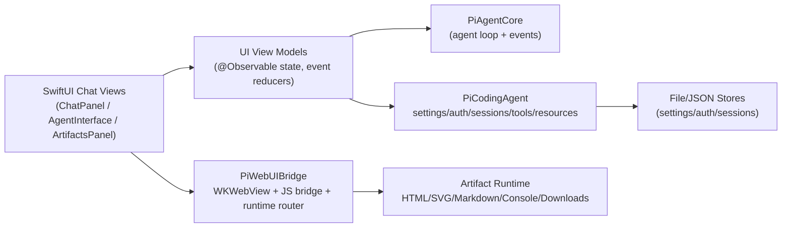

# PiWebUI Feature Mapping and Swift Platform Design (`P6-1`)

## Goal

Define how `../pi-mono/packages/web-ui` (Web Components + browser storage + sandboxed artifacts) maps to Swift-native surfaces without regressing core end-user capabilities.

This document is a design/mapping artifact, not a feature implementation.

## Source Baseline (`pi-mono` web-ui)

Primary evidence reviewed:

- `/Users/anyuan/Development/pi-mono/packages/web-ui/README.md`
- `/Users/anyuan/Development/pi-mono/packages/web-ui/src/index.ts`
- `/Users/anyuan/Development/pi-mono/packages/web-ui/src/ChatPanel.ts`
- `/Users/anyuan/Development/pi-mono/packages/web-ui/src/components/AgentInterface.ts`
- `/Users/anyuan/Development/pi-mono/packages/web-ui/src/storage/types.ts`
- `/Users/anyuan/Development/pi-mono/packages/web-ui/src/components/sandbox/RuntimeMessageBridge.ts`

## `pi-mono` Feature Inventory (What Exists Today)

### 1. Chat UI Surface

- `ChatPanel` high-level composed UI (chat + artifacts panel)
- `AgentInterface` lower-level chat interface
- message list + streaming message container
- message editor + attachments + model selector + thinking selector
- cost/usage display and callbacks

### 2. Attachments and Artifacts

- attachments preview and attachment overlay dialogs
- attachment loading / extraction utilities
- artifact panel with HTML / SVG / Markdown / text / image / document artifacts
- artifact tool renderer integration

### 3. Tool Rendering UX

- tool renderer registry
- built-in tool renderers (`bash`, calculate, time, default, artifacts)
- console blocks / thinking blocks / expandable sections

### 4. Browser Sandbox Runtime Integration

- sandbox iframe bridge (`postMessage`)
- runtime message router + bridge code generation
- runtime providers (attachments, artifacts, console, downloads)
- browser-extension / sandbox URL customization hooks

### 5. Storage and Persistence (Browser-First)

- IndexedDB-backed storage backend abstraction
- stores for settings / provider keys / sessions / custom providers
- quota/persistence APIs

### 6. Provider/Auth and Settings UX

- API key prompt dialog
- settings dialog and providers/models tabs
- custom provider dialogs/cards
- proxy settings support

### 7. Integration/Extension Points

- `toolsFactory(...)` injection from host app
- `sandboxUrlProvider(...)`
- `onApiKeyRequired`, `onBeforeSend`, `onCostClick`
- storage backend abstraction for non-IndexedDB backends

## Swift Platform-Equivalent Design (Proposed)

## Target Platforms

- Primary: macOS app (SwiftUI)
- Secondary: iOS/iPadOS app (SwiftUI; reduced artifact execution surface)
- Optional: hybrid WebView host for artifact/sandbox rendering

## Design Principle

Port behaviors, not DOM implementation details.

- Keep `PiAgentCore` as the session/loop engine
- Rebuild UI in SwiftUI
- Isolate browser-only features behind adapters (`WKWebView`, file system, JS bridge)
- Preserve user workflows (chat, streaming, artifacts, attachments, settings, sessions)

## Proposed Swift Module Mapping

### `PiWebUIBridge` (existing placeholder -> target integration layer)

Role:

- platform bridge for artifact rendering and runtime messaging
- `WKWebView` wrappers and JS bridge plumbing
- sandbox message router equivalent (Swift side)

Maps from TS:

- `SandboxedIframe`
- `RuntimeMessageBridge`
- `RuntimeMessageRouter`
- runtime providers (`ArtifactsRuntimeProvider`, `AttachmentsRuntimeProvider`, etc.)

### `PiCodingAgent` (already implemented core app logic)

Role:

- settings/auth/session/resource/tool orchestration
- CLI and shared logic
- reusable stores/models for desktop UI host

Maps from TS:

- stores/settings/provider keys/custom providers/session persistence semantics
- attachment processing and export flows

### New SwiftUI UI Surface (proposed package or app target)

Suggested future module name:

- `PiWebUISwift` (or app-local UI layer if not published as a library)

Role:

- SwiftUI equivalents of `ChatPanel` / `AgentInterface`
- dialogs, selectors, message rendering, artifact panel

## Feature-by-Feature Swift Mapping

### ChatPanel / AgentInterface

TS baseline:

- `ChatPanel` composes `AgentInterface + ArtifactsPanel`, responsive split/overlay

Swift equivalent:

- `PiChatPanelView`
- `PiAgentInterfaceView`
- `PiArtifactsPanelView`
- `NavigationSplitView` (macOS/iPad) or overlay sheet/drawer (iPhone)

Key parity points:

- streaming updates from `PiAgentCore`
- model/thinking selection
- attachments before send
- artifact badge/count and open/close state
- usage/cost click callback

### Message Rendering and Streaming

TS baseline:

- stable message list + separate streaming container for incremental updates

Swift equivalent:

- `LazyVStack` message list + dedicated `StreamingAssistantMessageView`
- `@Observable` session/view-model subscribed to `PiAgentCore` events

Key parity points:

- avoid full list re-render on every token
- inline tool result rendering linkage by tool-call ID
- thinking block / console block / expandable sections

### Attachments

TS baseline:

- browser file picker + attachment preview + document extraction helpers

Swift equivalent:

- `FileImporter` / drag-and-drop / pasteboard image import
- attachment preview tiles
- reuse `PiCodingAgentFileProcessor` for CLI-like file argument processing where applicable
- document extraction via platform services or delegated tools (future)

Key parity points:

- mixed text + image user messages
- attachment metadata persistence in session records (design extension needed)
- `blockImages` / `autoResize` settings semantics already present in `PiCodingAgent`

### Artifacts and Sandboxed Execution

TS baseline:

- HTML/SVG/Markdown artifacts with runtime bridge and provider messaging

Swift equivalent:

- `WKWebView`-backed artifact renderer for HTML/SVG/JS-capable artifacts
- native renderers for text/image/markdown where possible
- JS <-> Swift message bridge (`WKScriptMessageHandler`)

Key parity points:

- isolated execution context per artifact/sandbox instance
- attachment/artifact/download/console runtime provider capabilities
- host-controlled sandbox URL/policy equivalent (in Swift: configuration object)

### Storage

TS baseline:

- browser `IndexedDB` abstraction with quota/persistence reporting

Swift equivalent:

- `PiCodingAgent` JSON/file stores (already built) as default desktop backend
- optional SQLite/CoreData backend later if performance/search requires it

Key parity points:

- sessions listing + metadata
- settings/provider keys/custom providers persistence
- storage diagnostics (translate quota semantics to disk usage diagnostics)

### Provider/Auth/Settings Dialogs

TS baseline:

- dialogs for API keys, settings, providers/models, custom providers, session list

Swift equivalent:

- SwiftUI sheets/popovers:
  - `ApiKeyPromptSheet`
  - `SettingsSheet`
  - `ModelSelectorSheet`
  - `SessionListSheet`
  - `CustomProviderSheet`

Key parity points:

- no provider key in logs/UI snapshots
- proxy/custom-provider validation UX
- parity with `PiCodingAgentSettingsManager` and `AuthStorage`

## Architecture Sketch (Swift)

## Sample Validation (Design-Level)

Validated parity mapping for the most important user flow:

1. User opens chat UI, selects model, and sends a message with attachments
2. `PiAgentCore` emits streaming assistant events
3. UI renders stable history + streaming message separately
4. Tool calls produce tool-result UI blocks
5. Artifact-producing tools update artifact panel and badge count
6. Session/settings/auth persist through `PiCodingAgent` stores

This flow is achievable with existing implemented modules:

- `PiAI`
- `PiAgentCore`
- `PiCodingAgent`
- `PiTUI` (not used directly for web-style GUI, but useful as interaction/reference semantics)
- `PiWebUIBridge` placeholder ready to receive `WKWebView` runtime bridge implementation

## Known Gaps / Future Tasks (Not Part of `P6-1`)

- `P6-2` / `P6-3`: Slack bot and pods CLI migrations
- Actual SwiftUI component implementation (`PiChatPanelView`, etc.)
- `WKWebView` runtime provider bridge implementation in `PiWebUIBridge`
- Session schema extension for web-style attachment/artifact message persistence parity
- `.jsonl` session/export compatibility (currently deferred from `P5-10`)

## `P6-1` Verification (Completed)

- Design review completed against `../pi-mono/packages/web-ui` source exports/README/core components
- Swift platform-equivalent architecture and feature mapping documented
- Sample validation flow documented (chat -> streaming -> tools -> artifacts -> persistence)
- No code changes in this task (docs/design only)
